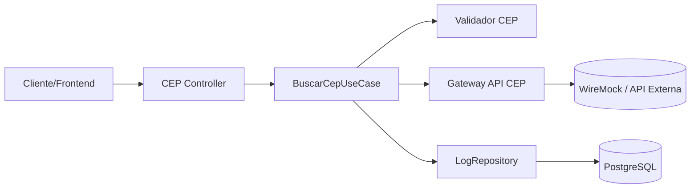

# Desenho de Solução — Consulta de CEP

## Diagrama (Mermaid)

## Fluxo

1. Cliente chama `GET /api/ceps/{cep}`.
2. Controller delega ao caso de uso.
3. Caso de uso valida formato do CEP.
4. Gateway consulta API externa (real ou mock).
5. Resultado (sucesso/erro) é persistido com timestamp.
6. Resposta retorna ao cliente.

## Modelo de log sugerido

- `id` (UUID)
- `cep_consultado` (string)
- `data_hora_consulta` (timestamp)
- `status_http_externo` (int)
- `payload_retorno` (json/text)
- `origem` (real|mock)

## SOLID aplicado

- **SRP**: controller só orquestra entrada/saída HTTP.
- **OCP**: nova API de CEP pode ser adicionada implementando a porta.
- **LSP**: adapters de API externa substituíveis.
- **ISP**: interfaces pequenas (`CepLookupGateway`, `CepQueryLogRepository`).
- **DIP**: UseCase depende de abstrações, não de classes concretas.

## Testes

- Unitário de validação de CEP.
- Unitário do caso de uso com mock de gateway/repositório.
- Integração com WireMock simulando API de CEP.
- Integração de persistência com banco local/docker.
